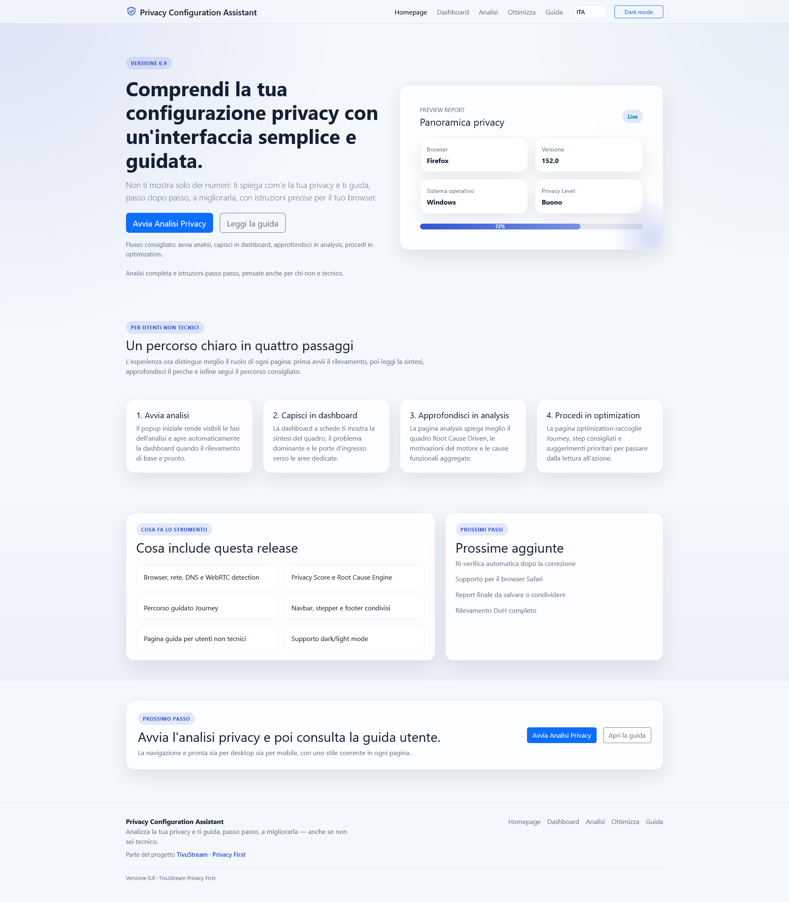
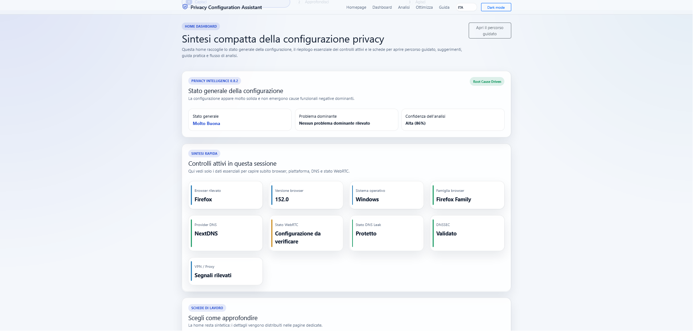

# Privacy Configuration Assistant

[🌐 English](README.md) · **🇮🇹 Italiano**

> Assistente che analizza la configurazione privacy dell'utente e, invece di limitarsi a mostrare numeri, lo **guida passo passo** verso la correzione e ne verifica la risoluzione. Pensato per utenti non tecnici.

**🔗 Sito live: [privacyassistant.tivustream.com](https://privacyassistant.tivustream.com)**

Parte del progetto [TivuStream · Privacy First](https://tivustream.com).

## Screenshot





## Principio

Progressione a quattro livelli: raccogliere il dato tecnico, interpretarlo, spiegarlo in linguaggio semplice, guidare verso una soluzione utile con istruzioni precise per il browser in uso.

## Stato attuale — v0.9

Moduli attivi:

- Browser Detection
- Network Detection (IPv4/IPv6, lingua, timezone, risoluzione, Do Not Track)
- DNS Provider Detection (catalogo, probe, verifica anche per resolver DoH come NextDNS)
- DNS Leak Detection
- DNSSEC / DNS Security Detection
- WebRTC Analysis
- VPN Protection Analysis (osservazione neutra, senza giudizio)
- Privacy Score
- Recommendation Engine con istruzioni passo passo per browser (IT/EN)
- Privacy Intelligence Engine con Root Cause Layer
- Privacy Journey Engine — percorso guidato

Prossime aggiunte: ri-verifica automatica dopo la correzione, supporto Safari, report finale esportabile, DoH detection completo.

## Struttura

```
index.html            Homepage e avvio analisi
dashboard.html        Sintesi Root Cause Driven
analysis.html         Approfondimento analitico
optimization.html     Percorso guidato Journey e raccomandazioni
guide.html            Guida per utenti non tecnici
assets/css/styles.css Tema (light/dark) e componenti UI
assets/js/            Motori di detection, intelligence, journey, score, i18n
```

## Architettura dei motori

Flusso: **detection → adapter → segnali normalizzati → Root Cause → analysis core → Journey / UI**.

Ogni nuova verifica si aggiunge ai margini (nuovo modulo di detection + adapter + registrazione nel mapping delle Root Cause) **senza modificare il core di analisi**. L'elenco delle estensioni previste vive in `FUTURE_SIGNAL_ADAPTERS` dentro `privacy-intelligence-engine.js`. La UI legge il risultato, non lo ricalcola.

## Pubblicazione

Il sito è statico (HTML/CSS/JS, nessuna build) ed è pubblicato su **Cloudflare** con deploy automatico a ogni push su `main`. URL di produzione: [privacyassistant.tivustream.com](https://privacyassistant.tivustream.com).

## Esecuzione in locale

Il progetto è statico, ma alcune rilevazioni usano `fetch`/WebRTC e richiedono un server HTTP locale (aprire il file con `file://` può bloccarle).

Con Python:

```
cd privacyassistant
python3 -m http.server 8000
```

Poi apri `http://localhost:8000/index.html`.

In alternativa, con Node: `npx serve` oppure l'estensione Live Server di VS Code.

## Documentazione

- `CHANGELOG.md` — storico delle release

Le note tecniche e le specifiche di progettazione sono mantenute separatamente per uso interno.

## Licenza

Rilasciato sotto [Licenza MIT](LICENSE).
