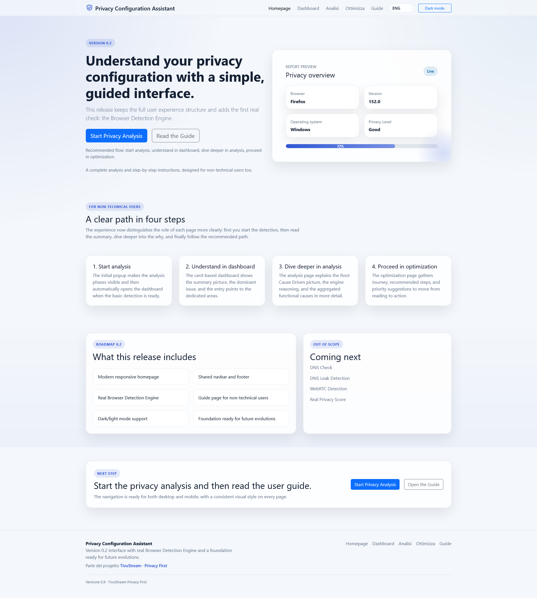
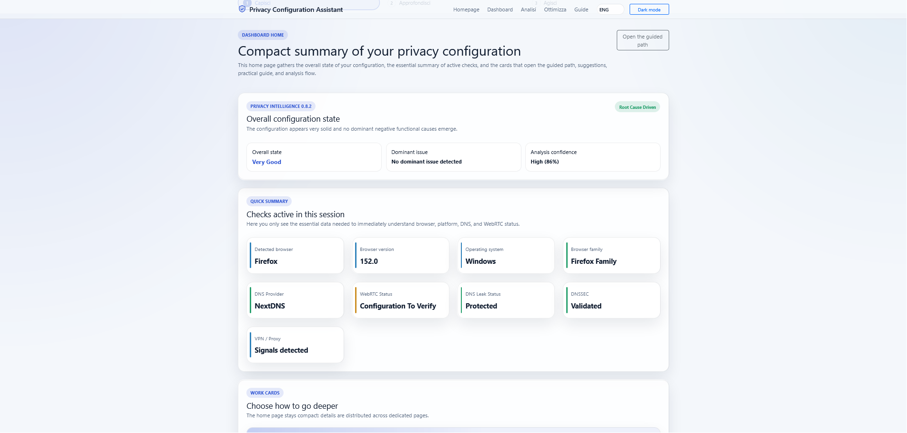

# Privacy Configuration Assistant

**🌐 English** · [🇮🇹 Italiano](README.it.md)

> An assistant that analyzes a user's privacy configuration and — instead of just showing numbers — **guides them step by step** toward fixing issues and verifies the resolution. Built for non-technical users.

**🔗 Live site: [privacyassistant.tivustream.com](https://privacyassistant.tivustream.com)**

Part of the [TivuStream · Privacy First](https://tivustream.com) project.

## Screenshots





## Principle

A four-level progression: collect the technical signal, interpret it, explain it in plain language, and guide the user toward a useful fix with precise instructions for the browser in use.

## Current status — v0.9

Active modules:

- Browser Detection
- Network Detection (IPv4/IPv6, language, timezone, resolution, Do Not Track)
- DNS Provider Detection (catalog, probe, including DoH resolvers such as NextDNS)
- DNS Leak Detection
- DNSSEC / DNS Security Detection
- WebRTC Analysis
- VPN Protection Analysis (neutral observation, no judgment)
- Privacy Score
- Recommendation Engine with step-by-step, per-browser instructions (IT/EN)
- Privacy Intelligence Engine with Root Cause Layer
- Privacy Journey Engine — guided path

Coming next: automatic re-verification after a fix, Safari support, exportable final report, complete DoH detection.

## Structure

```
index.html            Homepage and analysis launcher
dashboard.html        Root Cause Driven summary
analysis.html         Analytical deep dive
optimization.html     Guided Journey and recommendations
guide.html            Guide for non-technical users
assets/css/styles.css Theme (light/dark) and UI components
assets/js/            Detection, intelligence, journey, score, i18n engines
```

## Engine architecture

Flow: **detection → adapter → normalized signals → Root Cause → analysis core → Journey / UI**.

Each new check is added at the edges (a new detection module + adapter + registration in the Root Cause mapping) **without touching the analysis core**. The list of planned extensions lives in `FUTURE_SIGNAL_ADAPTERS` inside `privacy-intelligence-engine.js`. The UI reads the result; it does not recompute it.

## Deployment

The site is static (HTML/CSS/JS, no build step) and is published on **Cloudflare** with automatic deploys on every push to `main`. Production URL: [privacyassistant.tivustream.com](https://privacyassistant.tivustream.com).

## Running locally

The project is static, but some checks use `fetch`/WebRTC and need a local HTTP server (opening files via `file://` can block them).

With Python:

```
cd privacyassistant
python3 -m http.server 8000
```

Then open `http://localhost:8000/index.html`.

Alternatively, with Node: `npx serve`, or the Live Server extension for VS Code.

## Documentation

- `CHANGELOG.md` — release history

Technical notes and design specifications are kept separately for internal use.

## License

Released under the [MIT License](LICENSE).
